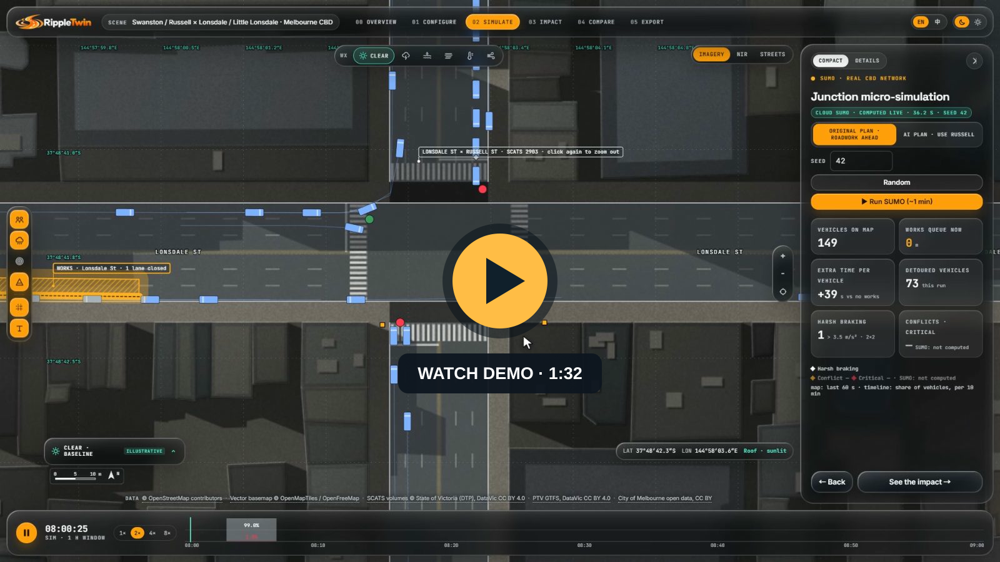

# RippleTwin

**Model the road closure before the barriers go out.**

**Team Uncapped** · FEIT Hackathon Festival 2026 · Challenge 5 — RPM Hire, *Future Cities: Digital Tool for Temporary Infrastructure*

[](https://youtu.be/y2zOMj6vj7k)

[▶ Demo video (1 min 25 sec · 1440p)](https://youtu.be/y2zOMj6vj7k) · [Live demo](https://hackathon-site.zemmmeng.workers.dev) · **Built:** 29 Sep 09:30 → 1 Oct 12:00 AEST 2026 · **Repo:** public

---

## 1. The problem

Every week, councils approve traffic management plans, and contractors hire barriers, signs and VMS (variable message sign) boards — from companies like RPM Hire. Before that gear goes out, nobody can say how long the queue will be, which trams and buses will run late, or where pedestrians will have to walk. How many drivers will detour is a rule of thumb, and every permit is checked on its own.

## 2. What RippleTwin does

RippleTwin is a digital twin of the Melbourne CBD for temporary works. Place the barriers, signs and VMS boards you would actually hire, and see what drivers, tram and bus riders and pedestrians will see, do and lose — on real data.

| Step | What happens |
|---|---|
| **01 Plan** | Pick a street and an hour (or click any CBD street), close one lane or all lanes, keep or close the footpaths, and write the text on the VMS frames and the static sign. |
| **02 Junction sim** | An animated micro-simulation in the browser (our own JavaScript). For works in the demo block it runs the four junctions around them (Lonsdale and Little Lonsdale × Swanston and Russell) and counts harsh braking; elsewhere it plays a scripted Swanston × La Trobe scene that also flags near-misses. Signal timing and turn shares are assumed; the headline numbers come from the engine, not from this animation. |
| **03 Impact** | See *why*: the queue, the extra delay per vehicle, where drivers go instead, which streets slow down, what it costs tram and bus riders and pedestrians — and how each type of driver read the sign. |
| **04 Improve** | A rule-based advisor suggests better sign wording and checks it with the engine. Compare three plans (A · Minimum, B · Standard, C · Guided) with equipment counts and assumed hire costs, choose one, and export a one-page pack. |

### One lane on Lonsdale Street, 8 am

| Standard sign — `ROADWORK AHEAD` | One more frame — `USE RUSSELL ST` |
|---|---|
|  |  |
| queue ≈ 900 m · ~8.5 min extra per car · ~175 vehicle-hours lost in that hour · 15 tram and bus routes (~1,900 riders an hour) slowed | queue ≈ 540 m · ~4 min extra per car · ~94 vehicle-hours lost (−46%) · tram and bus riders' delay −41% |

Same barriers, same sign board, same hire bill — only the words changed. RippleTwin lets you test the words before the barriers go out, and its rule-based advisor suggests better ones: with `USE / RUSSELL / SAVE 9 MIN` the engine puts the queue at about 215 m, if drivers trust the sign as much as we assume.

## 3. It's live, and the numbers are computed — not written into the page

The engine runs in the browser in **under 10 ms** on the real CBD network and returns the same answer every time. No impact figure is typed into the page: every queue, delay, detour share and rider-minute is computed by the engine from the plan you draw, hire costs come from the equipment list's assumed day rates, and without the engine those panels stay empty. (The step 02 animation and the weather layer are separate from the engine, and the page labels their assumptions.)

A language model does two jobs, and neither is arithmetic. It reads each sign the way a driver would — would they notice it, understand it, trust it, and which way does it send them? — and it words the plain-English explanation of the plan comparison, where any sentence with a number the engine did not produce is dropped. Both run on DeepSeek through our own Cloudflare Worker, so the key never reaches the browser. The demo's sign wordings were read ahead of time and ship with the site (labelled "LLM · precomputed"); any new wording you type is sent to DeepSeek, with answers cached; the Worker still counts every call against a daily ceiling (50,000), and the prepaid DeepSeek balance is the real spending limit. Without a key, over the ceiling, once the balance runs out or on an error, both fall back to transparent rules, and the screen always says which source was used. The model's only numbers are each road user's chances of noticing, understanding and trusting a sign; the engine turns those into route choices, and every minute, queue length and detour share comes from the engine.

## 4. What's real and what's assumed

We say which is which, on screen, everywhere.

**Real, open data:** 1,513 CBD road links (street segments) with real geometry and speeds · 8 weeks of hourly traffic-signal detector counts (SCATS, via DataVic) · Public Transport Victoria tram and bus timetables (GTFS) · City of Melbourne pedestrian counts · building footprints and floor counts · 8 weeks of hourly weather from Open-Meteo, used offline to back-test the weather layer. All downloaded ahead of time by scripts in `apps/roads/tools/`; **no data API is called at runtime.**

**Our assumptions, labelled:** about three-quarters of link flows are interpolated · 29 of 37 behaviour parameters are low-confidence and shown with a range · equipment quantities and day rates are ours, because RPM Hire publishes no prices (16 equipment items: the 7 hire products link to their RPM Hire product pages, and the 9 static signs use Transport for NSW sign codes) · the pull of "save 9 minutes" on driver choice is our model's assumption. How many drivers follow a recommended detour is calibrated to a field study at two motorway sites outside Oslo, where about every fifth vehicle changed route as recommended (Erke, Sagberg & Hagman, 2007). What drivers say they would do is not taken at face value: in London, only one-fifth as many drivers diverted as a survey predicted (Chatterjee et al., 2002). Sources in §10. The weather layer on the map is illustrative and labelled so; the engine ignores weather, and our back-test against 8 weeks of real hourly weather found that rain barely changes CBD car volumes.

## 5. How to run it

Requires Node ≥ 20, Python ≥ 3.9, git.

```bash
git clone https://github.com/Zemmeng/hackathon.git && cd hackathon
bash scripts/setup.sh                  # checks tools, enables git hooks, creates .env
bash scripts/check.sh --quick          # look for the line "======== 汇总 0 ❌ …" (汇总 = summary)

# the whole demo on one origin: page + engine + data + precomputed sign readings
cd apps/site && npm ci && npm run dev  # → http://localhost:8790/web/public/
```

Serving `apps/web/public` on its own is only for UI work: without the other modules it cannot load the engine or the real city, so it shows no engine numbers.

`bash scripts/check.sh` runs the full suite (nine checks, all module tests). `bash scripts/check.sh --e2e` smoke-tests the deployed URL. Deployment goes through `apps/site` (one Cloudflare Worker that mounts every module's `public/` and proxies `/api/*` to the API Worker, `apps/api`, deployed as `hackathon-api`) — see `apps/site/README.md`.

## 6. Tech stack

| Layer | What we used | Why |
|---|---|---|
| Data preparation | Python + OSMnx, networkx, geopandas, shapely | Offline only, never shipped |
| Road/traffic engine | Plain JavaScript, no framework | Runs in the browser and in Node; deterministic, <10 ms |
| Web page | Hand-written HTML/CSS/JS, one build script (`apps/web/build.py`) | No bundler and no JavaScript from a CDN; only the web fonts load from Google Fonts |
| Sign reading / explain API | Cloudflare Worker (`apps/api`) calling DeepSeek, with a Cloudflare KV cache and rule fallback | Service binding behind the same origin; the key never reaches the browser |
| Junction micro-sim, SUMO version (prototype) | Eclipse SUMO 1.27.1 + sumolib, Python (`apps/web/tools/sumo`) | Runs locally only; the step 02 animation on the live page is our own JavaScript |
| Hosting | Cloudflare Workers (`apps/site`) | One origin, no CORS |
| Fonts | Google Fonts (Inter, JetBrains Mono, Noto Sans SC, Space Grotesk, Barlow, Barlow Condensed, IBM Plex Mono) | SIL OFL 1.1 |

All code under `apps/` was written during the event — by the team, with the AI coding assistants listed in §7 — except two small test helpers in `apps/api` copied from our pre-event template (see §7). SUMO and the Python libraries are installed, not copied in, and the data files under `apps/roads/public/` are built from the open datasets in §4. No map tiles, no CDN JavaScript, no stock images, no 3D assets — the map is drawn from that JSON.

## 7. Third-party material, APIs and AI tools

The full list — every dataset with its licence and attribution line, every purchase, and how AI was used — is in **[docs/submission.md](docs/submission.md)**. In short: only open data (OSM ODbL; DataVic / Department of Transport and Planning and Open-Meteo CC BY 4.0; City of Melbourne open data — see the table for each dataset's terms); one paid API in the product — DeepSeek, called from our Cloudflare Worker to read sign text and to word the plan explanations, on pay-as-you-go credit with a daily call cap; one open-source simulator used offline (Eclipse SUMO); AI coding assistants (Claude Code, OpenAI Codex), listed there too; and no image or video generation models anywhere in the project.

**Before the event.** Before 29 Sep 09:30 the repository held only team-workflow tooling — process docs, git hooks, CI, check and deploy scripts, AI-assistant settings and starter templates for practising the GitHub workflow — with no RippleTwin product code, design, graphics or data. The product was built during the event; the only carry-over is two small test helpers in `apps/api`, with no product logic. The templates, process docs and AI-assistant settings have since been removed from the working tree and stay readable in the public git history. Details in [docs/submission.md](docs/submission.md) §3.

## 8. Team

Team **Uncapped**, five members. Module ownership and reviewers are in [`.github/CODEOWNERS`](.github/CODEOWNERS).

## 9. Where things are

Most internal docs are in Chinese; the English essentials are this README and [docs/submission.md](docs/submission.md).

| Path | What |
|---|---|
| [`apps/`](apps/README.md) | Seven modules: `sim`, `roads`, `web`, `engine`, `api`, `params`, `site` |
| [`docs/1-brief.md`](docs/1-brief.md) | The challenge we picked, the rules, the marking criteria |
| [`docs/2-plan.md`](docs/2-plan.md) | Approach, module split, milestones |
| [`docs/contract.md`](docs/contract.md) | Interfaces between modules |
| [`docs/decisions.md`](docs/decisions.md) | Product decisions (in Chinese), each with the alternatives we rejected |
| [`docs/arch/`](docs/arch/README.md) | Architecture and module PRDs |
| [`docs/pitch-assets/`](docs/pitch-assets/README.md) | Pre-screening PDF, architecture diagrams, before/after screenshots |
| [`docs/submission.md`](docs/submission.md) | Third-party list, AI use, what existed before the event |
| [`handoff/`](handoff/README.md) | Session hand-off notes — how the five of us actually worked |

## 10. References

Sources behind the numbers in this README and in [`apps/params/public/params.json`](apps/params/public/params.json). Each was checked on 30 Sep 2026 against Crossref, the publisher or the official page; the note after each entry says only what that source supports.

- Australian Transport Assessment and Planning Guidelines Steering Committee. (2016). *PV2 Road parameter values*. Transport and Infrastructure Council, Commonwealth of Australia. https://www.atap.gov.au/sites/default/files/pv2_road_parameter_values.pdf — values of travel time (private car $14.99 per person-hour, June 2013 prices).
- Austroads. (2020). *Guide to traffic management part 10: Transport control – types of devices* (Edition 3.0, AGTM10-20). https://austroads.gov.au/publications/traffic-management/agtm10 — VMS messages: one frame preferred, two acceptable, three to be avoided.
- Bonsall, P. W., & Palmer, I. A. (1999). Route choice in response to variable message signs: Factors affecting compliance. In R. Emmerink & P. Nijkamp (Eds.), *Behavioural and network impacts of driver information systems* (pp. 181–214). Ashgate. Reissued by Routledge, 2018: https://doi.org/10.4324/9781351119740-9 — early surveys reported diversion anywhere from 10% to 80%.
- Chatterjee, K., Hounsell, N. B., Firmin, P. E., & Bonsall, P. W. (2002). Driver response to variable message sign information in London. *Transportation Research Part C: Emerging Technologies, 10*(2), 149–169. https://doi.org/10.1016/S0968-090X(01)00008-0 — only one-fifth as many drivers diverted as the stated-intention survey predicted.
- City of Melbourne. (n.d.). *Update of the strategic transport evidence base* [Slide deck]. https://s3.ap-southeast-2.amazonaws.com/hdp.au.prod.app.com-participate.files/8115/2150/7514/VISTA_2015-16_Summary.pdf — car occupancy of 1.09 persons per vehicle for work trips to the City of Melbourne (2016 Census journey to work).
- Dudek, C. L. (2001). *Variable message sign operations manual* (Report No. FHWA-NJ-2001-10). New Jersey Department of Transportation. https://www.nj.gov/transportation/business/research/reports/FHWA-NJ-2001-010.pdf — VMS message design and length.
- Erke, A., Sagberg, F., & Hagman, R. (2007). Effects of route guidance variable message signs (VMS) on driver behaviour. *Transportation Research Part F: Traffic Psychology and Behaviour, 10*(6), 447–457. https://doi.org/10.1016/j.trf.2007.03.003 — at two motorway sites outside Oslo, about every fifth vehicle changed route as the VMS recommended.
- O'Fallon, C., & Sullivan, C. (2007). *Light/medium commercial vehicle use in four urban centres* (Research Report 316). Land Transport New Zealand. — qualitative background on delivery drivers in city centres.
- Standards Australia. (2019). *Variable message signs, Part 1: Fixed signs* (AS 4852.1:2019) and *Part 2: Portable signs* (AS 4852.2:2019). — the Australian VMS standards; worksite trailer signs fall under Part 2.
- Transport for NSW. (2021). *Variable message signs* (Specification TSI-SP-008, Issue 7.0). https://standards.transport.nsw.gov.au/_entity/annotation/170e2dfb-b735-ed11-9db1-000d3ae011f9 — legibility distance taken as 700 times the upper-case letter height.
- Wardman, M., Bonsall, P. W., & Shires, J. (1996). *Stated preference analysis of driver route choice reaction to variable message sign information* (Working Paper 475). Institute of Transport Studies, University of Leeds. https://eprints.whiterose.ac.uk/id/eprint/2114/ — earlier traffic counts suggested messages divert between 5% and 80% of drivers.

---

# 中文：队内协作

## 三条硬规矩

<!-- RULES:BEGIN -->
🔒 **1. 不直接改 main。** 一个任务一个分支，合并走 PR。 / Never commit to `main`; one task = one branch = one PR.
🔒 **2. 只写自己模块的目录。** 公共文件只能新建或追加，要改别处先写交接单。 / Only write inside your own module; shared files are append-only.
🔒 **3. key / token 只放 .env。** 不进 git、不进聊天、不进交接单，文档里只写变量名。 / Secrets live only in `.env`; never in git, chat or handoff notes.
<!-- RULES:END -->

规矩怎么落到机制上：`不直推 main` 由 `.githooks/pre-push` 拦；`只写自己模块` 由 `scripts/check.sh [3]` 和 `.github/CODEOWNERS` 拦；`秘密不入库` 由 `.githooks/pre-commit`、`check.sh [1][2]` 和 CI 拦。

## 怎么跑

```bash
bash scripts/setup.sh                  # clone 后跑一次（幂等）：查工具、启用 hooks、建 .env
bash scripts/check.sh --quick          # 小步走完就跑；找「======== 汇总 0 ❌」那一行
bash scripts/check.sh                  # 全量：九项检查 + 所有模块测试
cd apps/<模块> && npm i && npm run dev  # 端口看 apps/README.md 的登记表
```

`bash scripts/sync.sh` 是零 token 的实况对齐（各分支最近提交、开着的 PR、没落账的交接单、倒计时）。

## 分支与提交

```bash
git fetch origin
git switch -c <handle>/<模块>/T<n>-<短名> origin/main
# …小步 commit：「<模块>: 做了什么 —— 为什么」…
git merge origin/main                   # 同步 main（merge，不 rebase）
bash scripts/check.sh --quick           # 全绿再推
git push -u origin HEAD && gh pr create --fill
```

合并后**不用你部署**：`hackathon.conf` 里的 `DEPLOYER`（当前 @unicornnnnnny）在每个集成点跑 `bash scripts/deploy.sh all`，线上地址见顶部 Demo。

## 收工

写一张交接单 `handoff/<handle>-T<n>-<MMDD-HHMM>.md`（四节模板在 [handoff/README.md](handoff/README.md)）并 push。接别人的活先 `gh pr checkout <号>` 再读那张单。

## 常见问题

| 症状 | 处理 |
|---|---|
| push 被拒：`🚫 pre-push：不直推 main` | 你在 main 上。开分支把改动带过去再推 |
| push 被拒：分支名不合规 | `git branch -m <handle>/<模块>/T<n>-<短名>` |
| PR 有冲突 | 本地 `git merge origin/main`；`decisions` / `pitfalls` 会自动两边保留 |
| `check [3]` 报越界 | 把改动写进交接单第 2 节让 lead 落实；确需跨模块：`ALLOW_CROSS=1 git push`，开 PR 后请 lead 打 `cross-module` 标签 |
| 端口被占 | 手动起就换端口，并把新端口写进 `apps/README.md` 的登记表 |
| Windows | 用 Git Bash 或 WSL；`.gitattributes` 已强制 LF |

## 文档地图

| 文件 | 什么时候看 |
|---|---|
| [hackathon.conf](hackathon.conf) | 截止时间、冻结点、谁部署 |
| [docs/1-brief.md](docs/1-brief.md) | 赛题、评分标准、提交物 |
| [docs/2-plan.md](docs/2-plan.md) | 方案、模块分工、里程碑 |
| [docs/contract.md](docs/contract.md) | 模块之间的接口 |
| [docs/3-tasks.md](docs/3-tasks.md) | 任务板、谁在做什么 |
| [docs/4-demo.md](docs/4-demo.md) | 演示脚本、pitch、兜底、提交清单 |
| [docs/decisions.md](docs/decisions.md) | 已定的事，别再推翻 |
| [docs/pitfalls.md](docs/pitfalls.md) | 踩过的坑，别再踩 |
| [docs/submission.md](docs/submission.md) | 第三方清单、AI 使用、赛前准备说明 |
| [docs/llm-apis/](docs/llm-apis/README.md) | 候选大模型 API：谁有 key、多少钱、怎么调 |
| [docs/deploy-cloudflare.md](docs/deploy-cloudflare.md) | 怎么部署到 Cloudflare |
| [handoff/](handoff/README.md) | 交接单怎么写 |
| [apps/README.md](apps/README.md) | 模块规则、端口表 |
| [scripts/README.md](scripts/README.md) | 脚本和 hook 一览 |

## 秘密与额度

- `.env` 从 `.env.example` 复制，文档里只写变量名
- 线上密钥：`npx wrangler secret put <NAME>`，见 [docs/deploy-cloudflare.md](docs/deploy-cloudflare.md)
- 付费脚本默认 dry-run，加 `--run` 才花钱；每次花钱记进 `docs/3-tasks.md` 的额度台账

## 披露与 License

本仓库的构建脚本、分支守卫和 CI 是赛前准备的协作工具，不含业务代码；赛前写的 `starters/` 通用骨架已按 D-0929-1311 删掉，业务代码全部在比赛期间写。唯一例外：`apps/api/test.sh` 和 `apps/api/tests/mini.mjs` 是零依赖的测试运行器（不含业务逻辑），开赛后从赛前的 starter 拷过来（`mini.mjs` 原样，`test.sh` 只改了临时目录名一行）。逐项说明与第三方清单见 [docs/submission.md](docs/submission.md)。

`apps/roads/public/cbd/` 下的 `network.json`、`walk.json`、`buildings.json` 由 OpenStreetMap 衍生，按 **ODbL 1.0 share-alike** 分发，不是 MIT。其余代码见 [MIT](LICENSE)。
